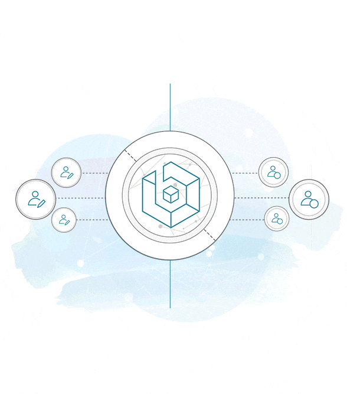
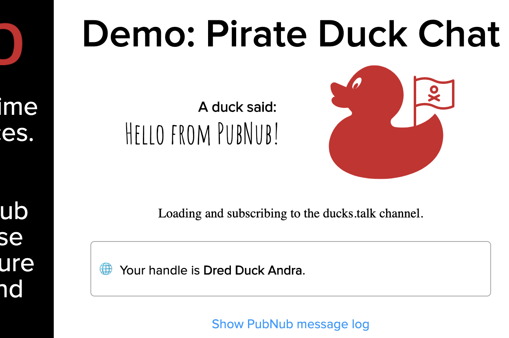
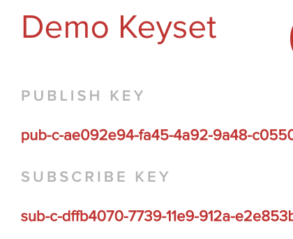
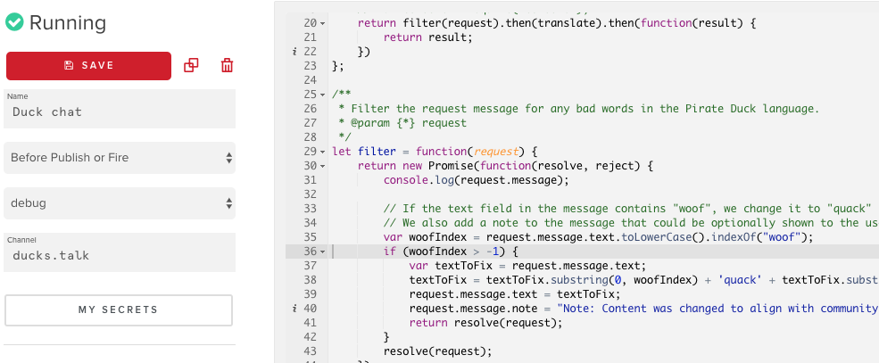
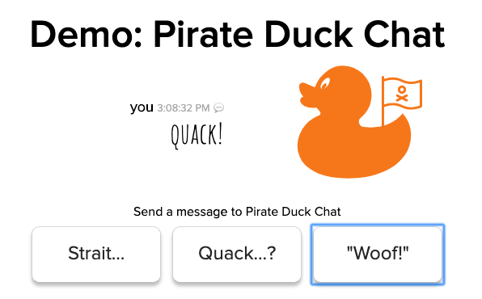

In the previous chapter of the Pirate Duck saga, the Pirate Duck Admiral, A`Quack, demanded a chat room for the rafts of pirate ducks around the world. Pirate Duck IT delivered it with the help of PubNub's globally distributed realtime data network.

However, there is a problem with the chat system as delivered. The 3rd button is always stuck sending the word "Woof!" Sadly, the word "Woof!" is banned in the pirate duck community. No one knows exactly why, but the story (pirate ducks have many stories) is that A`Quack was once chased by a light-brown Dachshund named "Earl". Regardless, Pirate Duck IT now needs to filter out the word "Woof" from all chat traffic. Since the app is distributed around the world, redeployed the client is challenging.

In addition, A`Quack has demanded that all chat messages get translated into Morse Code. She won't say why or what she wants to do with it, but every message needs to be translated and delivered with a morse code payload.

## The requirements

* For every message sent, filter out the word "woof" and replace it with "quack" before delivery.
* Translate every message into morse code and deliver it as part of the message payload.

## PubNub Functions
Luckily, PubNub has an option to install code in a serverless environment that can operate on and transform messages as they pass through the PubNub data stream network. 



There are [four different types](https://www.pubnub.com/docs/blocks/function-types) of PubNub Functions:

* Before Publish or Fire
* After Publish or Fire
* After Presence
* On Request

For the requirements as listed, the "Before Publish" is the best choice.

## Prerequisites
The only prerequisite knowledge is a general familiarity with Javascript. For tools, you will need Git to clone the starter repository and a reasonably modern browser.

It will be helpful to go through the Basic Chat Tutorial. The starter code below begins at the completion of that workshop.

## Get the base code
For this workshop, the HTML, CSS and non-PubNub specific Javascript code are already in the repository.  Clone the code at [https://github.com/mdfw/pubnubducks](https://github.com/mdfw/pubnubducks) *and* checkout the [`workshop-easy-filter`](https://github.com/mdfw/PubNubDucks/tree/workshop-easy-filter) branch. 

```bash
git clone git@github.com:mdfw/PubNubDucks.git
cd PubNubDucks/
git checkout workshop-easy-filter
```

If you've checked out the `workshop-easy-filter` branch, open `index.html` in your browser, you will see something resembling this:


`Your handle` should be different, but the general outline should be the same. 

## Signing up for PubNub and setting keys
If you have not done so already, you will need [PubNub keys](https://www.pubnub.com/developers/tech/admin-dashboard/keys-object?devrel_gh=pubnubducks_filter). PubNub is free for up to 1 million messages a month and does not require a credit card at sign up. 

<a href="https://dashboard.pubnub.com/signup?devrel_gh=pubnubducks_filter">
    
</a>

Once signed up, get the subscribe and publish keys. Click the project created for you (probably called "Demo Project") and then click the keyset (probably called "Demo Keyset"). Then you can copy the Publish and Subscribe keys.



We won't be using the Secret Key in this workshop. Use the Secret Key when adding authentication using the [PubNub Access Module](https://www.pubnub.com/developers/tech/security/access-manager?devrel_gh=pubnubducks_filter).

Open `js/pubnub-keys.js` and make the following replacements:

* The `PUBNUB_PUBLISH_K` key "DEMO-PUBLISH-KEY" with your publish key 
* The `PUBNUB_SUBSCRIBE_K` key "DEMO-SUBSCRIBE-KEY" with your subscribe key. 


Save and close. We will come back to the other keys in this file later. 

## Working demo
At this point, if you open `index.html` in your browser you should see buttons to send messages after your browser connects to PubNub. If not, make sure you have the right keys set and check the javascript console in your browser for errors.

If you click the "Woof!" button, the message is sent to PubNub and sent back to your browser because of the subscription to the `ducks.talk` channel. But, we need to filter out that terrible word and translate everything into morse code.

We need to add our filter and translation function.

## Installing a function
1. Visit the [PubNub administration](https://admin.pubnub.com?devrel_gh=pubnubducks_filter) screen (log in if necessary) and click the "Functions" button on the left.
2. Select your application (probably called "Demo Application").
3. Create a Module if it does not exist otherwise. I called it "duck chat" but the name is there for your information, it does not affect functionality.
4. Create a Function. 
    * Function name: you can choose, I called it "Pre-filter messages"
    * Event Type: `"Before Publish or Fire"`
    * Channel name: `ducks.talk` - note that this should match the name in the key `CHANNEL_NAME_TALK` in `js/pubnub-keys.js`. 
5. Click create to create the function.
6. Paste in the code from `PubNubFunctions/filter-and-translate/function-prefilter.js` into the editor.

7. Click Save on the left.
8. Click "Start module" or "Restart module" in the upper right.
9. Test by sending a "Woof!" message. It should be now changed to "Quack!"

### Note
If any of the `CHANNEL_NAME_…` keys are changed in `pubnub-keys.js`, the same changes should be made to the keys in this function.

## A look at the code
All PubNub function code should export only one default function. The one in the code block below:
1. Calls the `filter` function
2. Calls the `translate` function and returns the `result` as a promise. 

Since this is a `"Before Publish or Fire"` function, we receive the `request` object before it is delivered to the subscribers. Because of that, we modify the `request` before we return it. Other function types have different output requirements. 
```
export default (request) => {
    return filter(request).then(translate).then(function(result) {
        return result;
    })
};
```
### Bad word filter
This filter function *should not be used in production*. It only looks for the first instance of `woof` and changes it to `quack`. For more sophisticated options, look in our [Blocks Catalog](https://www.pubnub.com/docs/blocks-catalog?devrel_gh=pubnubducks_filter). Options include: [A basic word filter](https://www.pubnub.com/docs/blocks-catalog/chat-message-profanity-filter?devrel_gh=pubnubducks_filter) or a third-party solution by [Sift Ninja](https://www.pubnub.com/docs/blocks-catalog/siftninja?devrel_gh=pubnubducks_filter)

One thing to note, if we modify the request to quack, we add another key/value pair to our request object. The `note` key says that we've modified this message. In a non-demo application, you would probably want just a key that your user interface could interpret into the correct language for the user.
```
        var woofIndex = request.message.text.toLowerCase().indexOf("woof");
        if (woofIndex > -1) {
            var textToFix = request.message.text;
            textToFix = textToFix.substring(0, woofIndex) + 'quack' + textToFix.substring(woofIndex+4);
            request.message.text = textToFix;
            request.message.note = "Note: Content was changed to align with community standards."
            return resolve(request);
        }
        resolve(request);
```
### Translate to morse code
After filtering for `woof`, we then want to translate into morse code. To do that, we select the text out of the request object (already modified by our naughty word filter) and send it through a morse code translator that was found on [Stack Overflow](https://stackoverflow.com/a/26059399/1134731).

```
// Morse code alphabet not copied into this excerpt.
let translate = function(request) {
    return new Promise(function(resolve, reject) {
        //From https://stackoverflow.com/a/26059399/1134731
        let translated = request.message.text
            .split('')            // Transform the string into an array: ['T', 'h', 'i', 's'...
            .map(function(e){     // Replace each character with a morse "letter"
                return alphabet[e.toLowerCase()] || ''; // Lowercase only, ignore unknown characters.
            })
            .join(' ')            // Convert the array back to a string.
            .replace(/ +/g, ' '); // Replace double spaces that may occur when unknow characters were in the source string.
        request.message.morse = translated;
        resolve(request);
    });
}
```
At the end of the function, we attach the morse code to another key on our `message` JSON object (`request.message.morse`) and resolve the `request`. 

This is a fairly simple translation from English to Morse code. For more sophisticated machine translation of language, you will want to use the [`xhr`](https://www.pubnub.com/docs/blocks/xhr-module?devrel_gh=pubnubducks_filter) capability to call out from the PubNub serverless function to a more capable tool. There are multiple options in the [PubNub Blocks Catalog](https://www.pubnub.com/docs/blocks-catalog?devrel_gh=pubnubducks_filter?devrel_gh=pubnubducks_filter) for translation service from [AWS](https://www.pubnub.com/docs/blocks-catalog/amazon-translate?devrel_gh=pubnubducks_filter), [IBM Watson](https://www.pubnub.com/docs/blocks-catalog/multilingual-chat), [Microsoft](https://www.pubnub.com/docs/blocks-catalog/microsoft-translator-v?devrel_gh=pubnubducks_filter3), and [SDL](https://www.pubnub.com/docs/blocks-catalog/sdl?devrel_gh=pubnubducks_filter).

## Finally
A\`Quack is pleased with the filtering of `woof`. She thinks she never has to see that word in chat again. We know that the filter isn't perfect, don't we? But [PubNub Functions](https://www.pubnub.com/blog/pubnub-functions-crash-course/?devrel_gh=pubnubducks_filter) allow us to swap out the code without having to have ducks reload their app. If ducks get more sophisticated and work around our block (or use that *other* word that no ones speaks of - _shudder_), we can counteract. 

Finally, consider that we were able to meet the requirements of the duck admiral without ever having to touch our original code. It will be interesting to see how the morse code translation is used. Stay tuned.

