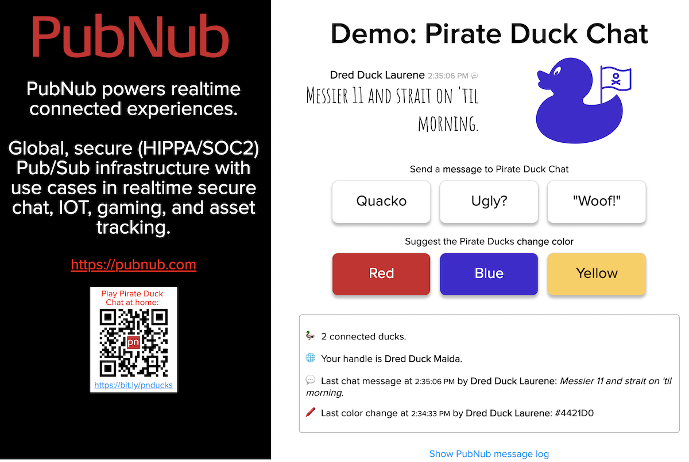
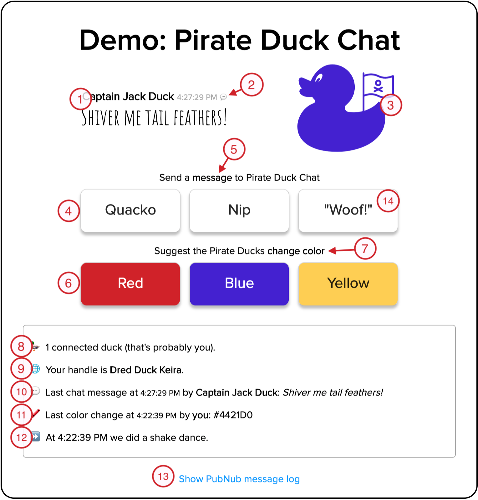
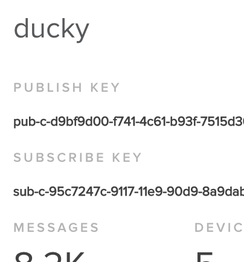

PubNub Pirate Duck Demo
============

<h2>A connected experience for pirate ducks. Arrr. </h2>

## Features
- Multiple PubNub [subscription](https://www.pubnub.com/developers/tech/key-concepts/publish-subscribe/?devrel_gh=pirate-duck-demo) channels for chat, color changing, dancing and bot pirate integration.
- PubNub [Presence](https://www.pubnub.com/docs/web-javascript/presence?devrel_gh=pirate-duck-demo) functionality & [HereNow](https://www.pubnub.com/docs/web-javascript/presence#here_now?devrel_gh=pirate-duck-demo) requests to get the number of connected ducks.
- PubNub [Storage & Playback](https://www.pubnub.com/docs/web-javascript/storage-and-history?devrel_gh=pirate-duck-demo) (history) functionality for updating UI state when connecting and reconnecting. History also used to show recent messages in the chat channel on request.
- Handling PubNub [network events](https://www.pubnub.com/docs/web-javascript/status-events?devrel_gh=pirate-duck-demo).
- Using [PubNub Functions](https://www.pubnub.com/docs/blocks/function-types?devrel_gh=pirate-duck-demo) for:
  - "Before Publish" function to simulate bad word filtering and translation.
  - "After Publish" function and PubNub's [KV Store](https://www.pubnub.com/docs/blocks/kvstore-module?devrel_gh=pirate-duck-demo) to track recent actions. With the correct set of actions, the functions sends a message that makes all of the ducks dance and wiggle.
  - "After Publish" function to simulate extra duck chat inhabitants.
- Built-in access to a log of recent incoming and outgoing PubNub messages to understand how changes happening in the interface are implemented.
- Use of [aria-live](https://developer.mozilla.org/en-US/docs/Web/Accessibility/ARIA/ARIA_Live_Regions) sections to support better accessibility on chat changes.

## Demo
[Try it! Let out your pirate duck.](https://mdfw.github.io/PubNubDucks/)

### Using the demo to talk about PubNub
The demo is specifically designed to be used in demo environments. Use the following as a guide.

1. This is the latest message sent on the `ducks.talk` channel. Name, time and content are all represented.
2. The talk bubble opens an overlay and calls the `history` api for the last 20 messages in the `ducks.talk` channel.
3. The duck is always the latest color message sent in the `ducks.color` channel. Shows how a chat room can turn into a connected experience, easily adding functionality not normally found in standard 'chat' solutions. 
4. Send a message to the `ducks.talk` channel. Sends the message up to the PubNub service and then the application receives that message and shows it in `1.` and `10.`.
5. Clicking the `message` word opens an overlay to allow users to send custom messages to the `ducks.talk` channel.
6. Send a color message to the `ducks.color` channel. Sends the message up to the PubNub service. The application receives that message and shows it in `3.` and `11.`.
7. Clicking the `change color` words opens an overlay to allow users to send custom color messages to the `ducks.color` channel.
8. Using PubNub's presence service on the `ducks.talk` channel, the application knows how many other ducks are connected. 
9. Each instance of the application generates a random duck name every time it is loaded. This is used as the [UUID](https://www.pubnub.com/docs/web-javascript/api-reference-configuration#uuid?devrel_gh=pirate-duck-demo) when interacting with the PubNub API.
10. The last `ducks.talk` message is listed here. aria-polite is used to announce the text change when using screen readers.
11. The last `ducks.color` message is listed here. aria-polite is used to announce the color change when using screen readers.
12. The last dance, the last message sent on the `ducks.dance` channel is listed here.
13. Clicking the "Show PubNub message log" will show the last 30 messages sent to and recieved from the PubNub service, in realtime. Use this to show developers how the JSON payload is packaged and displayed to the interface.
14. `"Woof!"` is considered a bad word in the pirate duck language. As such, it is always changed to `"Quack!"` through a very simple "Before Publish" PubNub Function. Use this to describe how Functions can interact with the content flowing through the network.

In addition to all of that, there is an "After Publish" PubNub function that listens to all messages posted to `ducks.talk` and `ducks.color`. The last three messages are stored in the KV Store. If the three are matched against a 'magic set', the function sends a 'dance' message to the `ducks.dance` channel. The dance aligns to one of the animations from animate.css. The duck will dance in response. Try `Yellow`, `Red`, `Blue` or `"Quack!"`, `"Quack!"`,`"Quack!"`. The full set of magic sequences can be found in the `function-dance.js` file in [PubNubFunctions/duck-dance](https://github.com/mdfw/PubNubDucks/tree/master/PubNubFunctions/duck-dance).

## Getting your own copy of Pirate Duck Chat
1. Sign up for PubNub

2. Create a new App or use one that is created for you when you sign up.

3. Install the `Publish key` and `Subscribe key` from the administration interface into the `pubnub-keys.js` files as `PUBNUB_PUBLISH_K` and `PUBNUB_SUBSCRIBE_K`.

3. Turn on Presence, Storage & Playback and PubNub Functions in the admin portal. (Keys -> (name of your application) -> Application add-ons) *Remember to Save Changes in the lower right corner.*

4. Optional: Follow the instructions in `PubNubFunctions/filter-and-translate/README.md` to install the pirate duck text chat filter and translation "before publish" PubNub Function.

5. Optional: Follow the instructions in `PubNubFunctions/duck-dance/README.md` to install the pirate duck dance "after publish" PubNub Function.

6. Optional: Follow the instructions in `PubNubFunctions/duck-bots/README.md` to install the pirate duck bots "after publish" PubNub Function.

7. Have fun.

## Credits
Pirate Duck Chat is maintained by Mark Williams

## License
Software is licensed under MIT (see license file).

The readme files are Copyright 2019 Mark D. F. Williams

## Acknowledgements
* Uses ["Duck" by Nikita Kozin](https://thenounproject.com/icon/945625/) from the Noun Project 
* Uses ["Pirate" by Andrejs Kirma, LV](https://thenounproject.com/icon/1263137/) from the Noun Project
* Thanks to [animate.css](https://github.com/daneden/animate.css) by Daniel Eden for making it easy to make the ducks dance.
* Some True Type fonts are used from [Google Fonts](https://fonts.google.com).

### Copyright
This readme © 2019 Mark D. F. Williams All Rights Reserved.