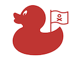

PubNub Pirate Duck Demo
============

## A PubNub Chat Demo using color changing, dancing, Pirate ducks. Arrr. 

## Features:
- Multiple PubNub channels for chat, color changing, dancing and bot pirate integration.
- PubNub HereNow and Presence functionaility to get the number of connected ducks.
- PubNub history funcionality for updating state when reconnecting.
- Handling PubNub network events.
- Using PubNub Functions for:
  - "Before Publish" function to simulate bad word filtering.
  - "After Publish" function and PubNub's KV Store to track recent actions and react by making the ducks dance and wiggle.
  - "After Publish" function to simulate extra duck chat inhabitants.
  - "On Request" API Enpoint function to allow interactions with the pirate duck chat from external sources. {not complete}
- Built-in access to a log of recent incoming and outgoing PubNub messages to understand how changes are in the interface are implemented.
- Use of aria-live sections to support better accessibility on chat changes.

---
## Credits
Pirate Duck Chat is maintained by Mark Williams

---
## License

---
## Acknowledgements
* Uses ["Duck" by Nikita Kozin](https://thenounproject.com/icon/945625/) from the Noun Project 
* Uses ["Pirate" by Andrejs Kirma, LV](https://thenounproject.com/icon/1263137/) from the Noun Project
* Thanks to [animate.css](https://github.com/daneden/animate.css) by Daniel Eden for making it easy to make the ducks dance.
* Some True Type fonts are used from [Google Fonts](https://fonts.google.com).