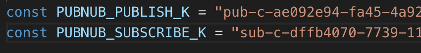
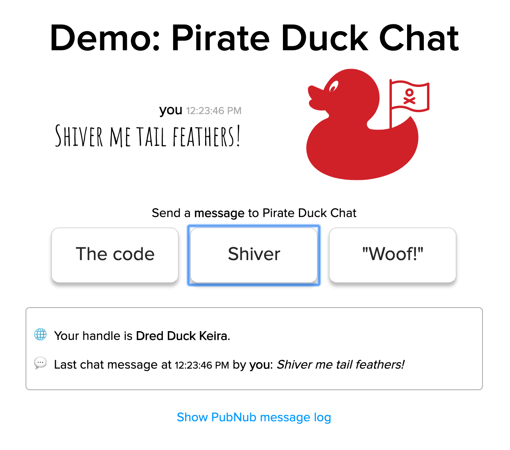

This is AQuack. 


She is the Pirate Duck Admiral. She wants to chat in real-time with the other pirate ducks on rafts distributed around the world - in realtime. And she wants it now.
 
The head Pirate Duck software engineer knows they could build a chat server with Websockets or Socket.IO, but will it scale to the massive numbers of ducks based in all corners of the globe? How many engineers will they have to dedicate to building and maintaining the backend? Pirate Ducks do not invest in large IT teams so it seems better to use [PubNub](https://www.pubnub.com?devrel_gh=pubnubducks_basic), with its [globally distributed endpoints](https://www.pubnub.com/developers/tech/network-infrastructure/?devrel_gh=pubnubducks_basic) and solid uptime.

## The requirements:
* Each session will be psuedo-anonymous, pirate ducks do not want to be identified.
* Pirate ducks should, by default, only have 3 or 4 message buttons. Typing with palmate feet and bills is difficult. 
    * Allow a separate text input area for those ducks that need it and are patient with their typing.
* Only the most recent message should display. Pirate ducks have good memories.

### Live Demo
See the full, final <a href="https://mdfw.github.io/PubNubDucks/" target="_blank" rel="noopener noreferrer">PubNub Pirate Duck Chat Demo live here</a>.

## Prerequisites
The only prerequisite knowledge is a general familiarity with *Javascript, HTML and CSS*. For tools, you will need a code editor, Git to clone the starter repository, and a reasonably modern web browser.

## Get the base code
For this workshop, the HTML, CSS and non-PubNub specific JavaScript code are already in the repository.  Clone the code at [https://github.com/mdfw/pubnubducks](https://github.com/mdfw/pubnubducks) *and* checkout the [`workshop-basic-chat`](https://github.com/mdfw/PubNubDucks/tree/workshop-basic-chat) branch. 

```bash
git clone git@github.com:mdfw/PubNubDucks.git
cd PubNubDucks/
git checkout workshop-basic-chat
```

If you've checked out the `workshop-basic-chat` branch, open `index.html` in your browser, you will see something resembling this:


`Your handle` should be different, but the general outline should be the same. 

> This workshop is based on a demo built for use at trade shows. 

## A Quick Look at the HTML
Opening the `index.html` file, you will find a few things:

* The duck image is an inline SVG. That will become important in a future workshop chapter.
* The 'chat' text buttons do not show by default. Once we wire up PubNub, they show up when a connection succeeds.
* These `.js` files import:
    * The [PubNub JavaScript SDK](https://www.pubnub.com/docs/web-javascript/pubnub-javascript-sdk?devrel_gh=pubnubducks_basic)
    * [jQuery](https://jquery.com/)
    * randomduckdata.js - a helper file that adds some randomness for sent messages, duck names and colors.
    * pubnub-keys.js - holds the keys used in the application (see below)
    * index.js - the main code.

## Signing up for PubNub and Setting API Kyes

To make our chat interactive, we will need [PubNub keys](https://www.pubnub.com/developers/tech/admin-dashboard/keys-object?devrel_gh=pubnubducks_basic). PubNub is *free* for up to 1 million messages a month and does not require a credit card at sign up. 

<a href="https://dashboard.pubnub.com/signup?devrel_gh=pubnubducks_basic">
    
</a>

Once signed up, get the subscribe and publish keys. Click the project created for you (probably called "Demo Project") and then click the keyset (probably called "Demo Keyset"). Then you can copy the Publish and Subscribe keys.


We won't be using the Secret Key in this workshop. Use the Secret Key when adding authentication using the [PubNub Access Manager](https://www.pubnub.com/developers/tech/security/access-manager/).

Open `js/pubnub-keys.js` and make the following replacements:

* The `PUBNUB_PUBLISH_K` key "DEMO-PUBLISH-KEY" with your publish key 
* The `PUBNUB_SUBSCRIBE_K` key "DEMO-SUBSCRIBE-KEY" with your subscribe key. 


Save and close. We will come back to the other keys in this file later. 

## Connecting to PubNub
Open `js/index.js`.

The code that updates the UI and reacts to clicks is included, but most of the PubNub specific code is not there. That's what we'll do below.

The first four lines of the `document.ready` function:

* `setMessagesOnButtons()` - There is a large set of messages that are "authorized" by Pirate Duck IT. However, we only have two buttons to use (the third button always says "Woof!" - a mystery solved in a later workshop chapter). This function picks two messages and assigns them to the buttons.
* `randomName()` and `updateDuckMetaName()` - Since the pirate ducks want to be anonymous, we create semi-anonymous names for them on every load.
* `updateDuckStatus` updates the status area that we are loading.

Let's add our first PubNub functionality, the connection to the PubNub service. 
> The code is also available in `js/workshop-code.js`. 

_Replace_:
```
/**
 * Connect to PubNub
*/
```
_with:_ 
```javascript
    /**
     * Sets up a connection to the PubNub service. 
     * Get publish and subscribe keys by signing up for the PubNub service (http://pubnub.com)
     * ssl - defaults to true, but we'll be specific here.
     * uuid - This is the identifier used by presence and publish systems to identify this unit.
     *        For this demo, we will use our randomly generated duck name. However, PubNub best 
     *        practice is to use a UUID and separately manage user names through other means. 
     */
    pubnub = new PubNub({
        subscribeKey: PUBNUB_SUBSCRIBE_K,
        publishKey: PUBNUB_PUBLISH_K,
        ssl: true,
        uuid: generatedDuckName,
    })
```
I'll restate this point: the way we use `UUID` here is not best practice. It works for the needs of this demo, but it should be unique for each client. Names should be managed separately. If you need ideas, see [the chat resource center](https://www.pubnub.com/developers/chat-resource-center/docs/users/?devrel_gh=pubnubducks_basic).

The `PUBNUB_SUBSCRIBE_K` and `PUBNUB_PUBLISH_K` should be the same variable names as those we filled in at the "Signing up for PubNub and setting keys" step above.

If you reload the browser, nothing will have changed. We need to add a listener.


> It is possible to publish a message to the PubNub network for other subscribers to receive without setting up listeners or subscribing. Publishing and subscribing are [separate activities](https://www.pubnub.com/developers/tech/key-concepts/publish-subscribe/?devrel_gh=pubnubducks_basic) that are not necessarily intertwined. In fact, in a future chapter of our workshop, we will allow an IoT device to *only* subscribe to a channel and another device to *only* publish to a channel. However, for our chat demo, we want to have both. So, we do not show the publishing functions until we've connected to PubNub and subscribed to the right channel.

## Add a Listener
When a duck in our pirate duck network sends a message to a channel we have subscribed to, PubNub will push that to us. We need to handle that message and any [network status events](https://www.pubnub.com/docs/web-javascript/pubnub-network-lifecycle?devrel_gh=pubnubducks_basic). We will add a listener object to manage that for us.

_Replace:_ 
```javascript
    /**
      * Add PubNub Listener
      */
```

_with:_
```javascript
   /**
     * After setting up a connection, add a listener for any messages that PubNub sends.
     * There are 2 types of messages we will react to:
     *   * status: Network up/down, connection changes, etc. Listen for these to update UI.
     *   * message: Messages sent from PubNub, normally in response to a
     *        Publish event somewhere on the network.
     */
    pubnub.addListener({
        status: function(statusEvent) {
            processStatusEvent(statusEvent);
        },
        message: function(messageEvent) {
            processReceivedMessage(messageEvent);
        }
    })
```
This code allows us to listen for `status`-type messages and `message`-type messages. There is another message type, `presence` that we will handle in a later chapter.

Next we need to add the actual functions that will handle the status and message events. 

> If you see `Suscribe to channels` in the code after the addListener section, don't worry, we will come back to subscribing in a minute.

## Handle Status Events
Our listener calls `processStatusEvent()`, so we should add that.

_Replace:_ 
```javascript
/**
 * Process status events
 */
```
_with:_

```javascript
 /**
 * Process status events.
 * This function does not handle the exhaustive list of status events. See documentation for others.
 *   This shows how an application may handle these events.
 *   If connection is offline, hide sending options, when it comes back, show the sending options (showChangeInterface())
 * @param {*} statusEvent 
 */
function processStatusEvent(statusEvent) {
    logReceivedMessage(statusEvent, "a status event");
    if (statusEvent.category === "PNDisconnectedCategory" || statusEvent.category === "PNTimeoutCategory" || statusEvent.category === "PNNetworkIssuesCategory" || statusEvent.category === "PNNetworkDownCategory") {
        hideChangeInterface();
        updateDuckStatus("<i>Internet connection is not available. The duck is sad.</i>");
    }
    if (statusEvent.category === "PNConnectedCategory" || statusEvent.category === "PNNetworkUpCategory") {
        showChangeInterface();
    }
}
```
As the documentation mentions, we do not handle all [statusEvent types](https://www.pubnub.com/docs/web-javascript/status-events?devrel_gh=pubnubducks_basic), but many of the common ones. The core logic is: 

* If we disconnect from PubNub, hide the buttons. 
* If we connect, show the buttons.

## Handle Received Messages
Our listener also calls `processReceivedMessage()`, but before we add that function, let's talk about what we need to process. A received message from PubNub is wrapped  into an envelope [JSON](https://www.pubnub.com/learn/glossary/what-is-JSON/?devrel_gh=pubnubducks_basic) object. That envelope will look like:
```json
{
  "channel": "ducks.talk",
  "timetoken": "15654132552683958",
  "publisher": "Dred Duck Jada",
  "message": {
    "text": "Messier 11 and strait on 'til morning.",
    "duckName": "Dred Duck Jada",
  },
  ...other fields...
}
```
Taking this line by line:

* `"channel": "ducks.talk"`: This tells us that the message was received on the `ducks.talk` channel. Channels are developer created text strings that define where a message is published to and where a system can subscribe to. You can create as many [channels as you need](https://support.pubnub.com/support/solutions/articles/14000043777-how-many-channels-can-i-use-?devrel_gh=pubnubducks_basic). 
* `"timetoken": "15654132552683958"`: [Token](https://support.pubnub.com/support/solutions/articles/14000043827-what-are-the-various-timetokens-used-in-pubnub-publish-subscribe-?devrel_gh=pubnubducks_basic) added to every message envelope that passes through the system.
* `"publisher": "Dred Duck Jada"`: Typically the UUID of the publisher of the message. Note: this may not be present.
* `"text": "Messier 11 and strait on 'til morning."`: The `"message"` object is the object that gets published by a publisher and wrapped by PubNub. The keys within the object are developer defined, not enforced by PubNub. In this case, the object includes the `"text"` field which matches to `CHANNEL_KEY_TEXT` from `js/pubnub-keys.js`.
* `"duckName": "Dred Duck Jada"`: The name of the duck that published this item. As you will see in a minute, we add that to the published message. _This is not best practice. How to attach names to content requires thought and is out of scope of this workshop._ Since our content is attached to psuedo-anonymous duck names that won't change, we can attach the name to the message object. Maps to the `CHANNEL_KEY_DUCKNAME` in `js/pubnub-keys.js`.

### Processing a Message
Now that we know what a message might contain, we can write code to process it.

_Replace:_
```javascript
/**
 * Process a received message.
 */
```

_with:_
```javascript
/**
 * Process received messages. First, log the message, then send to proper UI handlers.
 * @param {*} envelope 
 */
function processReceivedMessage(envelope) {
    logReceivedMessage(envelope, "a message");
    updateDuckTalk(envelope.message[CHANNEL_KEY_TEXT], envelope.message[CHANNEL_KEY_DUCKNAME], envelope.timetoken);
}
```
This parses the `envelope.message` object for the `CHANNEL_KEY_TEXT` and `CHANNEL_KEY_DUCKNAME` parameters, along with the `timetoken`, and passes them all to `updateDuckTalk`. `updateDuckTalk` will update the interface.

## Subscribing
Now that we have listeners with associated code to process received messages, we need to tell the PubNub service that we want to receive those messages. That's called [subscribing](https://support.pubnub.com/support/solutions/articles/14000043859-subscribe-?devrel_gh=pubnubducks_basic). A client can subscribe to multiple channels at one time. For now, we are just going to subscribe to the same channel that we will publishing messages to - the channel identified by the `CHANNEL_NAME_TALK` variable in the `js/pubnub-keys.js` file.

_Replace:_
```javascript
    /**
     * Suscribe to channels
     */
```

_with:_
```javascript
    /**
     * Subscribe to channels. Best practice is to bundle subscribe events when possible
     *   as it reduces network connections.
     */
    pubnub.subscribe({
        channels: [CHANNEL_NAME_TALK],
    });
```

This tells PubNub we want to receive any messages posted to the channel identified by `CHANNEL_NAME_TALK`. When that happens, the service sends it to the SDK which routes to our installed listener. 

If you reload now, you should connect to the PubNub service and the send message buttons should show. If you click on the `Show PubNub message log` link at the bottom you can see the messages received from PubNub. 

At this point, if someone published a message using your publish and subscribe keys and on the channel defined by `CHANNEL_NAME_TALK`, it would replace "Hello from PubNub!".

But, if you click on one of the buttons or tried to send a custom message, nothing will happen. We need to set up sending. 

## Sending a Message Over the PubNub Network
Receiving messages from others is interesting, but Ducks want to participate. The buttons and custom field to send messages are there now because we've made a subscribe connection. They just do not do anything because we do not have a sending function.

In `index.js` there are two functions that send chat messages, `handleCustomTextMessageSend()` and `handleButtonClick()`. These gather the chat message and send it to a function called `sendMessageToPubNub()`. Let's add that.

_Replace:_
```javascript
/**
 * Send a message to PubNub
 */
```

_with:_
```javascript
/**
 * Send a message to PubNub. Takes the channel, contentKey and content.
 * @param {*} channelName 
 * @param {*} contentKey 
 * @param {*} content 
 */
function sendMessageToPubNub (channelName, contentKey, content ) {
    let msgToSend = {
        channel: channelName,
        message: {
            [contentKey]: content,
            [CHANNEL_KEY_DUCKNAME]: generatedDuckName, 
        }
    };
    pubnub.publish(msgToSend, function (status, response) {
        if (status.error) {
            updateDuckStatus("There was an error sending your message.");
            setTimeout(function(){ updateDuckStatus(""); }, 5000);
        } else {
            logSentMessage(msgToSend, "a message to the '" + channelName + "' channel");
        }
    });
}
```
To send, we need a `channelName`, a `contentKey` and the `content` to send.

With those values, we build a message object with the channel and message content. We call in the `generatedDuckName` from earlier to send along with the message.

Next, we call `pubnub.publish` with the message object. If the [publish](https://www.pubnub.com/docs/web-javascript/api-reference-publish-and-subscribe#publish?devrel_gh=pubnubducks_basic) fails, we show a basic error message for a few seconds. If it succeeds, it adds to the message log. The message logs allows you to see what messages were sent and received. Nice for a demo, probably won't be necessary for production.

## Test it


At this point, Pirate Duck IT should have an app that meets the requirements set out by the Admiral and scales to the millions of rafts around the world. With this much communication, we can all welcome our new Pirate Duck overlords.

Next time: how to add a basic bad word filter and translator to our Pirate Duck app.
